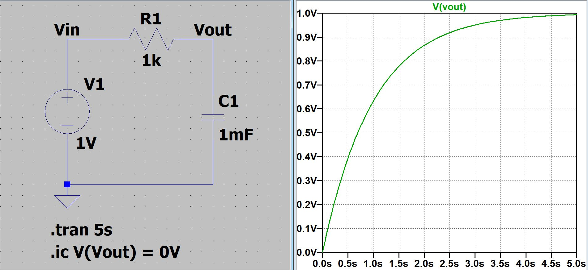
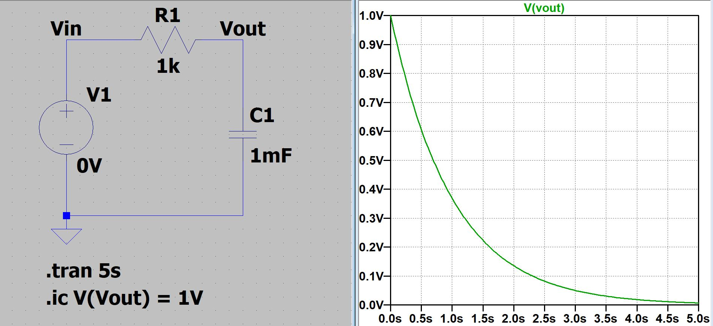
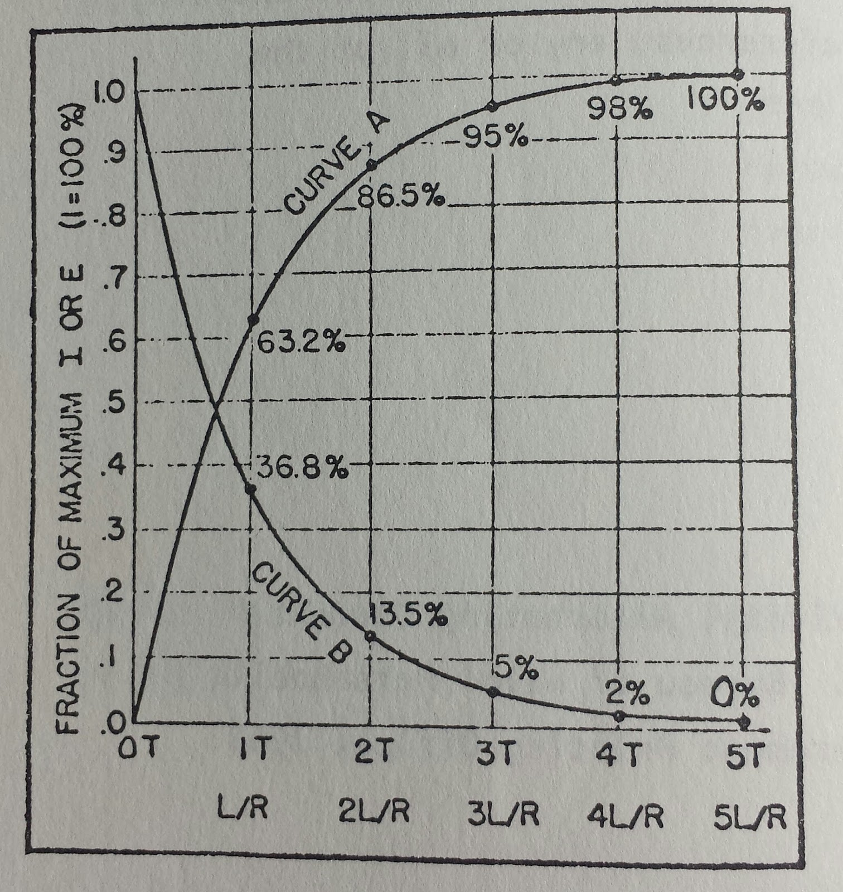

# Analog Circuits

Circuits that consist of more than two voltage states.

# Digital Circuits

## Voltage Divider

Divides the voltage in based on the resistances of the divider.

{ width="200" } 
$$
V_{out} = V_{in} \cdot{} \dfrac{R_2}{R_1 + R_2}
$$

## RC Circuits

A capacitor in series with a transmission line will take some time to charge. 

* For a DC Circuit, charged capacitors act like a wire
* For a AC Circuit, capacitors are considered open until charged.

$RC$  is considered the *time constant* $\tau{}$

$$
\tau{} = RC
$$

Current is produced by voltage differences in the circuit. The voltage on a capacitor is...

$$
\begin{equation}
    V = \dfrac{Q}{C}
\end{equation}
$$

==Charging Equation== - Voltage on capacitor while accumulating current
$$
\begin{equation}
v(t) = v_o \cdot{} (1-e^{{-t}/{RC}}) << Increasing \ Voltage \\
I(t) = I_o \cdot{} (1-e^{{-t}/{RC}}) << Decreasing \ Current
\end{equation}
$$
{width: "400"}
SPICE Sim -> [Click to Download](SPICE-files/RC-Charging.asc)

==Discharging Equation== - Voltage on capacitor while discharging current
$$
\begin{equation}
v(t) = v_o \cdot{} e^{{-t}/{RC}} << Decreasing \ Voltage\\ 
I(t) = I_o \cdot{} e^{{-t}/{RC}} << Increasing \ Current 
\end{equation}
$$
{width: "400"}
SPICE Sim -> [Click to Download](SPICE-files/RC-Discharging.asc)

For Circuit Analysis (note Voltage and Current are inversely related)

- 0.7$\tau{}$ = 50%
- 5$\tau{}$ = 100%  

{width=400}