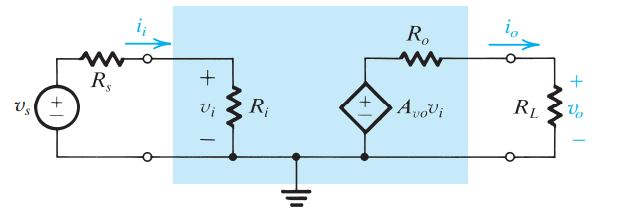

# Circuit Fundamentals
This section will go over the various basics of electronics and associated fields

## What is a Circuit?
**Electronic Circuit** - Any device that performs characterisitcs associated with the movement of electrons
> Ex: Static Shocks, Home Wiring, Light up Toys, etc.

A circuit can be generally considered to have 3 parts.

1. **Electron Source** - This "powers" the circuit
2. **Intermediate Devices** - Filters, IC's, anything that isn't in any other category
3. **Load** - The primary recipiant of the Electron Source. Usually an IC or a passive load.

## Definition of Current
**Conventional Current** - Direction of curent flow used for analysis

**Electron Flow** - Direction of electron flow (opposite of Conventional Current)
  
Trivia: This is because Ben Franklin took a coin flip to decide the direction of current and was wrong. Oh well.  

**Current** - The flow of electrons through a conductor

$$
\begin{equation}
    C = \dfrac{dq}{dt}
\end{equation}
$$

Current flow induces the following

1. **Heat** - More thermal disipation at higher currents and resistances. 
   The amount of energy disipated as heat is defined as H. Where H is the amount of heat disipated in Joules, I in Amps, R in Ohms, and t is time. 
$$
\begin{equation}
    H = I^2Rt
\end{equation}
$$
2. **EMF Field** - A conductor will build up a magnetic field, effictivley acting like an inductor.

## Definition of a Volt
$$
\begin{equation}
    V = \dfrac{potential\ energy}{charge} = \dfrac{J}{C} = \dfrac{kg\cdot{}m^2\cdot{}s^{-2}}{A\cdot{}s}
\end{equation}
$$

Through Ohm's Law. We know that...

$$
\begin{equation}
    V = A\cdot{}\Omega=\dfrac{Wb}{s} = \dfrac{W}{A} = \dfrac{J}{C} = \dfrac{eV}{e}
\end{equation}
$$

Note, Wb is webers per second (magnetic flux per time).

Volts is also **power per current** or **energy per charge**

The potential difference (voltage drop) from a to b in *joules per coulomb*

$$
\begin{equation}
    V_{ab} = \dfrac{dw}{dq} 
\end{equation}
$$

The **higher** your voltage, the more electromotive force is generated. This is because...
$$
\begin{equation}
    E = V + IR
\end{equation}
$$
Where R is the internal resistance of the motor. So **for no internal resistance, Electromotive Force is correlated to Voltage**

## Impedance and Admittance

**Impedance** = The effective resistance of an electric circuit from the combined effects of **resistance** and **reactance**

**Admittance** = Inverse of Impedance. A measure of ease of conduction.

{ width="400" }

## Amplifiers
A generic voltage amplifier commonly used in analog signal amplification due to its simplicity. 

{width: "300"}

* $A_{vo}R_i$ - Voltage Controlled Voltage Source
    * $A_{vo}$ - Gain Factor
    * $R_i$ - Input Resistance
* $R_o$ - Output Resistance - Accounts for change in output voltage as the amplifier is utilized to supply more output current to a load. 

When designing an amplifier, $R_o$ should always be smaller than $R_L$. This will maintain a voltage gain greater than 1. 

$$
\begin{equation}
    A_v = \dfrac{v_o}{v_i} = A_{vo}\dfrac{R_L}{R_L + R_o}
\end{equation}
$$

The input resistance induces a voltage divider action at the input. Where $R_S$ is the resistance from the source to the amplifier.

$$
\begin{equation}
    v_i = v_s \dfrac{R_i}{R_i + R_s}
\end{equation}
$$

So the effective gain of the circuit including the $R_S$ resistance is.
$$
\begin{equation}
   \boxed{\dfrac{v_o}{v_s} = A_{vo}\dfrac{R_i}{R_i+R_S}\dfrac{R_L}{R_L + R_o}}
\end{equation}
$$
### test
### Test 2
