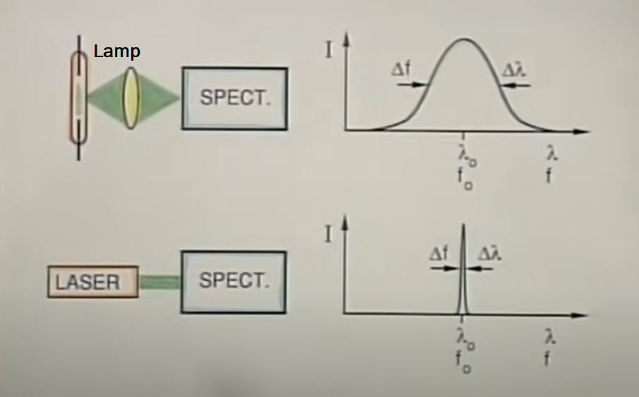
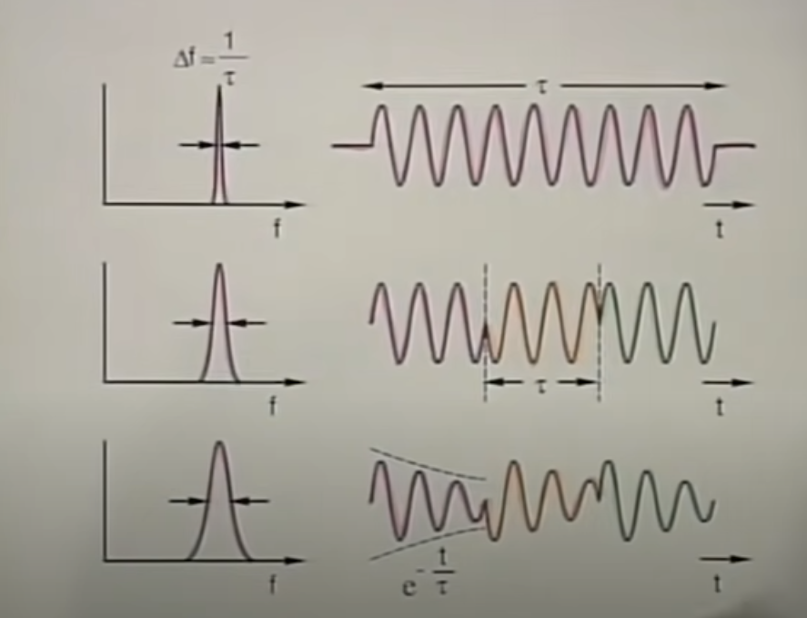
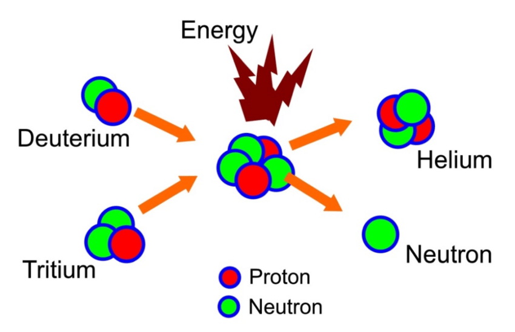
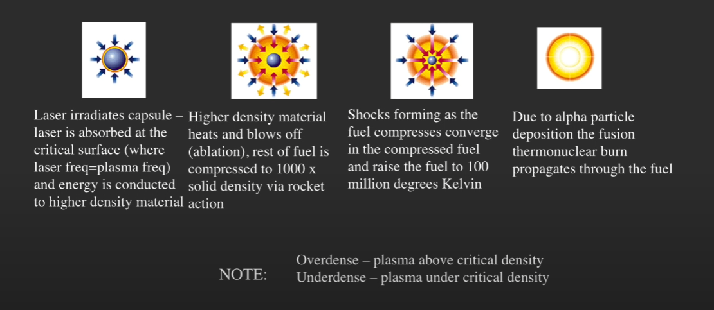

# LASERs 101

These notes are based off of a series called "Laser Fundamentals" produced by Dr. Shaoul Ezekiel and published by MIT OpenCourseWare

* [Laser Fundamentals I](https://www.youtube.com/watch?v=saVE7pMhaxk&list=PLX22u5cw7gIWC1djhphKPBabbReVpTpxU&index=20)
* [Laser Fundamentals II](https://www.youtube.com/watch?v=urbZ8CTceu0)
* [Laser Fundamentals III](https://www.youtube.com/watch?v=_qixt0NLc9I)
* [Laser Fundamentals III - Continued](https://www.youtube.com/watch?v=slNPMzQ4Nhw)

Other Material used

* [The Extreme World of Ultra Intense Lasers - with Kate Lancaster](https://www.youtube.com/watch?v=hcGgaa2mFc4)
## Part I
### Why are LASERs cool?

* Fantastic Applications
    - bar code readers
    - compact disks
    - LASER "shows"
    - color copiers
    - sensors
    - military systems
    - non-destructive testing
    - ==fiberoptic communication== << focus of most applications
    - medical procedures

### LASER Properies
1. Visible Range - Able to pick from a wide series of bands
2. Tight Spectrum Width - Precise control of the wavelength of the LASER
   {width="500"}
3. High Temperal Coherenece
       * Effectivley, the transmission of the beam continously is much larger than over conditional sources.
      * The smaller the width, $\Delta{}f$ the longer the $\tau{}$
      * Lets us predict the amplitude and phase at any posistion
        * Useful for communication, sensors, spectroscopy, etc.
{width="500"}
4. Intensity
      * Power = Intesity / Area
           * So either provide a LOT of power, or use a small area.

### Pulse LASERs
#### Q-Switching
* Precharge the LASER before emitting. Then open the cavity to release the charge, and recieve a pulse.
* Do this fast enough and you can get what appears to be a continous beam of high powered energy. 
#### Amplifier Chain
* A single LASER emission will go through a series of small and large rod amplifiers to add power to the beam. After a enough of these, a larger amplifier may be required, called a lense amplifier.

## Fusion
TLDR. Deuterium + Tritium = Helium + Neutron
{width="500"}

* Since there is a mass loss. In order to sustain $E=MC^2$, energy is produced!
* We can use this to heat water to produce steam.
* You can stop the reaction by removing the energy source.

{width="700"}

## Laser Emissions
1. Atom gains charge that it will want to release
2. The atom releases that charge in the form of a photon